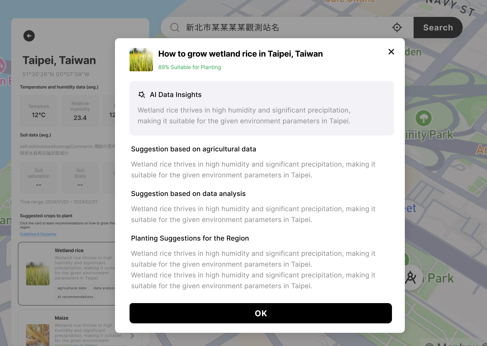

# Summary
Our project aims to empower farmers by providing them with a user-friendly tool that leverages NASA's Earth observation data to analyze temperature and humidity conditions. By inputting their farm's location, farmers can access detailed information about the temperature, humidity, and soil composition in their area. Additionally, the tool offers AI-generated recommendations on optimal crop selection and management practices based on the analyzed data. This tool is designed to assist farmers in making informed decisions about their agricultural operations, improving crop yields, and enhancing sustainability.

**[Project Demo (Slides)](https://drive.google.com/file/d/1QWz23YHfD82jtlZzBMOH65tMvlyEggyz/view?usp=sharing)**
**[Final Project](https://jakdf.us/)**

# Project Details
**What is this for?**

Discover valuable insights into crop suitability and optimize your farming practices.

Simply input a location to receive tailored recommendations based on real-time weather data, soil analysis, and historical crop yields.Our AI-powered tool empowers you to make informed decisions and maximize your crop yields.

**How are agricultural production recommendations generated?**

We use three main analysis methods to generate customized agricultural production recommendations:

* AI-based Analyzer: Like an experienced farmer, this analyzer considers your environmental factors, such as temperature, humidity, and rainfall, and recommends the crops best suited for these conditions.

* Rule-based Analyzer: Similar to an agricultural rulebook, this analyzer contains specific rules about the optimal growing conditions for different crops. It compares your local environmental data to these rules to see which crops are the best fit.
* Statistical Analyzer: Like a land surveyor, this analyzer examines your area to understand which crops grow well there. It categorizes land based on factors such as soil type, elevation, and historical growth patterns, then recommends crops that are well-suited for your area.

By combining these three methods, we can provide you with accurate and tailored agricultural recommendations. It's like having a team of AI, rulebooks, and land surveyors working together to help you make the best planting decisions!

# Disclaimer

The recommendation index provided are estimates calculated using historical weather data, soil quality assessments, and crop variety information. While every effort has been made to ensure the accuracy of these figures, factors such as unexpected weather events, pests, or diseases may affect actual crop yields. Therefore, this information is intended for general informational purposes only and should not be used as a substitute for professional agricultural advice.

# When and who to use?

Farmers, agricultural researchers, and anyone involved in agriculture or horticulture can benefit from this tool.Use this tool when you're planning to plant new crops and want to make informed decisions based on data.

# Why develop?

Our team is situated in an area with limited arable land and a declining agricultural population, making agricultural development a significant challenge. Due to the varying knowledge requirements for different crops, as well as the need for experience and background knowledge, we aim to leverage observational data, academic research, and AI to help aspiring farmers understand suitable regions and cultivation methods for their chosen crops. Additionally, we want to assist existing farmers in easily obtaining information to assess their crop cultivation status and understand the growth conditions of their crops in different regions.
